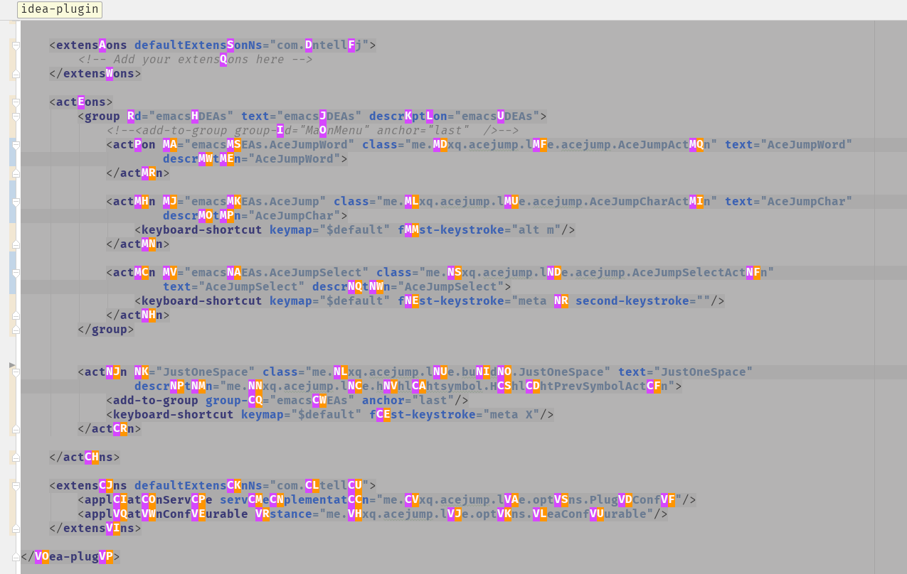

##### AceJump-Lite  

Simplify from [`emacsIDEAs`](https://github.com/whunmr/emacsIDEAs) and add some custom options.

----
- can choose move caret behind the target char or before 
- painting background on plugin active 
- display markers by upper case 
- custom markers
- background color and opacity
- font style: bold/plain  

---

- 增加光标移动到目标字符后面的选项
- 激活插件就渲染背景，增加反馈，提高体验
- 增加选项：转换所有标记为大写
- 可以自定义标记符号
- 增加背景颜色和透明度自定义
- 增加字体样式选项，可以选择粗体或者常规

